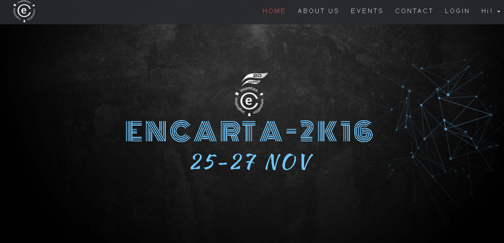
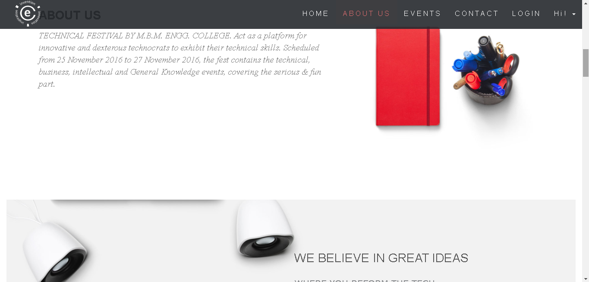
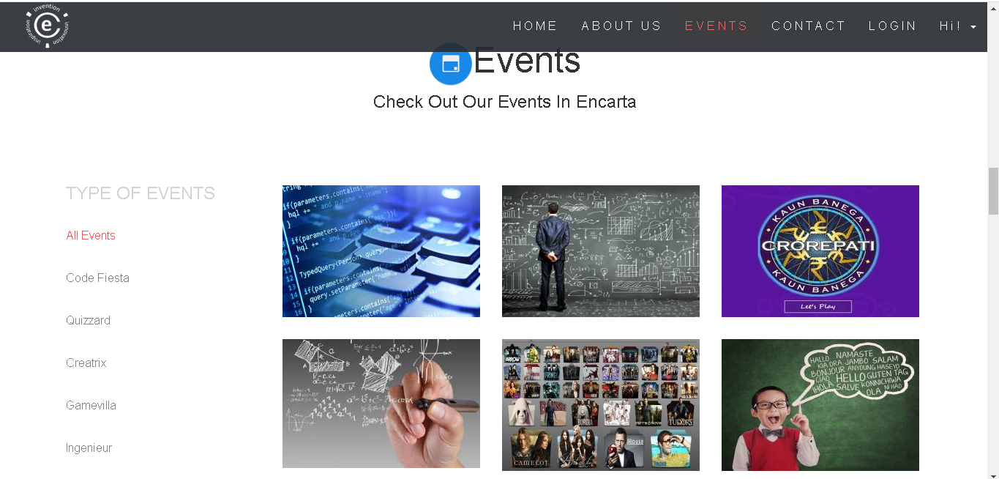
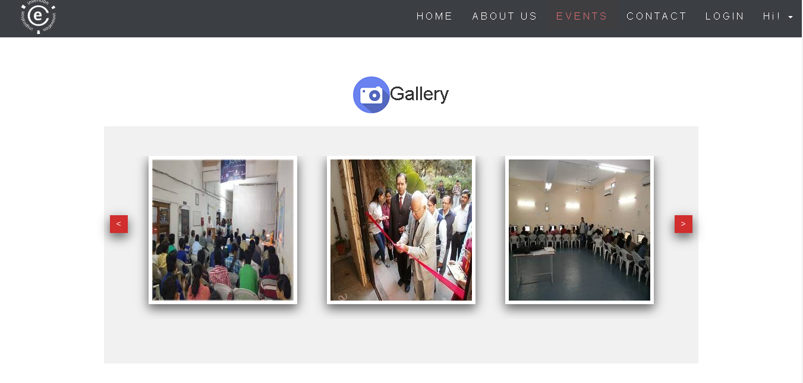
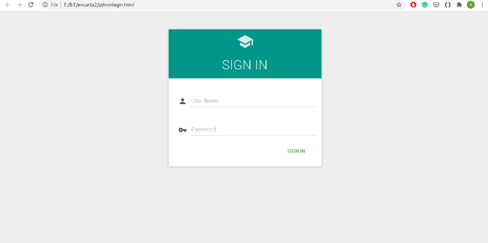
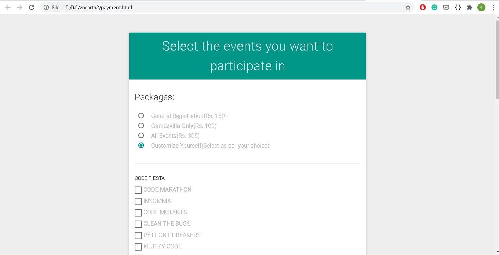
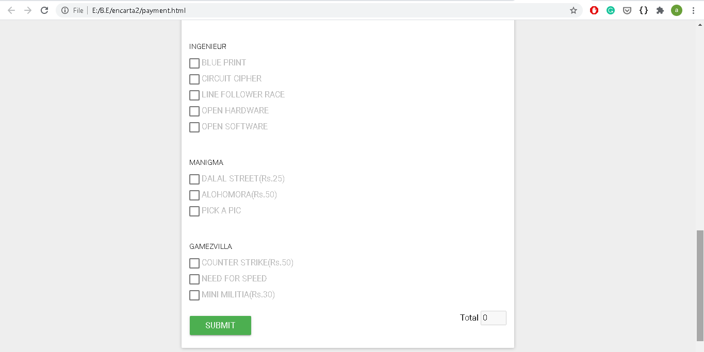

# Encarta2K16
Encarta is a Technical Festival conducted every in my college M.B.M. Engineering College, Jodhpur. Scheduled from 25 November 2016 to 27 November 2016, the fest contained technical, business, intellectual, and General Knowledge events, covering both the serious & fun part.

We developed a simple website for smoothly conducting this technical fest. In the site, Students can read and check the details about the events, register in them, and take part in Prelims Quizzes of events. This website acted as a single point of contact for sharing the event information among the city which lead to an increase in footfall to double from 200-300 to around 500-600 students.

### Developers
* Arpit Maheshwari
* Nilesh Hirani
* Apeksha Jain

### Technology Stack: 
* PHP
* HTML, CSS and Javascript
* JQuery 
* Bootstrap

### Some Screenshots from the project:

### Helpful Resources:
1. https://www.w3schools.com/  - Web development 
2. https://pixabay.com/ - Stock images
3. https://themefisher.com/products/airspace-free-bootstrap-website-template/ - Similar Template
